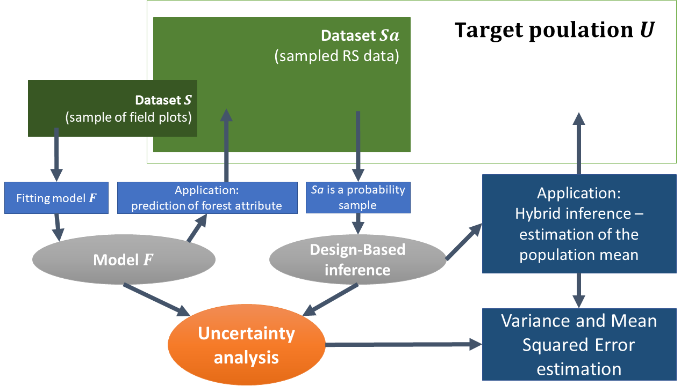
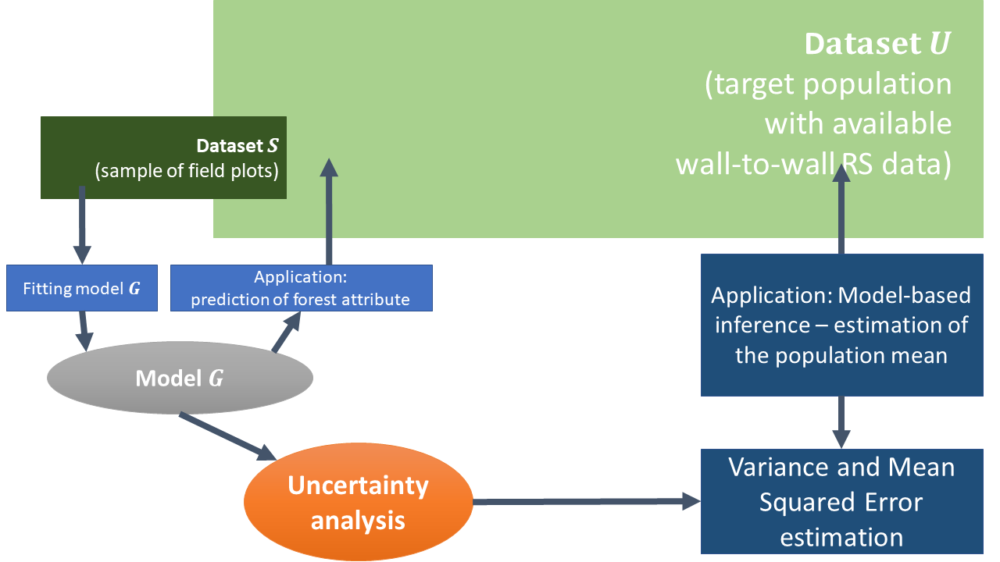
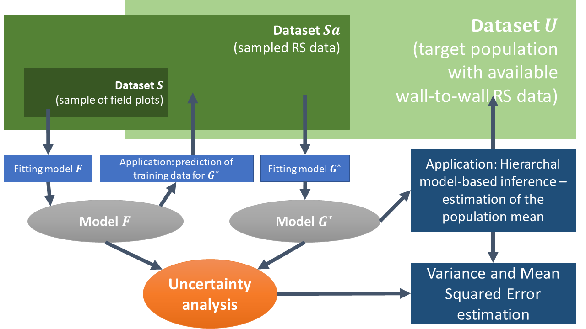

```{r echo=FALSE}
n  = params$n;
MM = params$SampFr;
MMlim = params$SampFrlim;
EnLargeFactor = params$EnLargeFactor;
TileSide = params$TileSide;
N = 100*params$TileSide^2;

nameStudyArea = params$nameStudyArea;
nameForestAtt = params$nameForestAtt;
nameRSdata    = params$nameRSdata;
#module        = params$module;

meanY_S   = params$meanY_S;
sigmaY_S  = params$sigmaY_S;

meanX_S   = params$meanX_S;
meanX_Sa  = params$meanX_Sa;
meanX_U   = params$meanX_U;
sigmaX_S  = params$sigmaX_S;
sigmaX_Sa = params$sigmaX_Sa;

meanZ_S   = params$meanZ_S;
meanZ_Sa  = params$meanZ_Sa;
meanZ_U   = params$meanZ_U;
sigmaZ_S  = params$sigmaZ_S;
sigmaZ_Sa = params$sigmaZ_Sa;

CorrYX    = params$CorrYX;
CorrYZ    = params$CorrYZ;
CorrXZ    = params$CorrXZ;

AutoCorrX    = params$AutoCorrX;
AutoCorrZ    = params$AutoCorrZ;
AutoCorrZ_Sa = params$AutoCorrZ_Sa;
AutoCorr     = params$AutoCorr;

PixelSize = params$PixelSize;

ylim = params$ylim;

# #####
# ## Sequences used in graphs
n_seq = seq(20, 300);
MM_seq = seq(0.0025, MMlim, 0.001);
MM_seq2 = seq(0.001, 1, 0.01);
N_seq = (seq(1, 40))^2;
Corr_seq = seq(0.000001, 1, 0.01);
DF_X = seq(-1.4, 3.5, 0.001);
DF_Z = seq(-1.4, 3.5, 0.001);
 
#####
## Fixed model parameters and population means: they are not changing over the change of given sequences.

Beta = CorrYX*sigmaY_S/sigmaX_S;
Alpha = CorrYZ*sigmaY_S/sigmaZ_S;
Gamma = CorrXZ*sigmaX_Sa/sigmaZ_Sa;

mu_HY  = meanY_S + (meanX_U - meanX_S)*Beta;
mu_MB  = meanY_S + (meanZ_U - meanZ_S)*Alpha;
mu_HMB = meanY_S + (meanX_Sa - meanX_S + (meanZ_U - meanZ_Sa)*Gamma)*Beta;

#####
## Autocorrelation 
source('AutoCorr_Utils_GS.R')

## for given N and autocorrelation value

if (AutoCorr == TRUE) {
  AutoCorrSumX = AutoCorrSum((N*10000/PixelSize), AutoCorrX);
  AutoCorrSumZ = AutoCorrSum((N*10000/PixelSize), AutoCorrZ);
  AutoCorrSumZ_Sa = AutoCorrSum((N*10000/PixelSize), AutoCorrZ_Sa);
} else {
  AutoCorrSumX = 0;
  AutoCorrSumZ = 0;
  AutoCorrSumZ_Sa = 0;
}

### For figures
color = c("HY - rRMSE" = "blue",   "HY - rSD" = "blue",
          "MB - rRMSE" = "red",    "MB - rSD" = "red",
          "HMB - rRMSE" = "green", "HMB - rSD" = "green");

linetype = c("HY - rRMSE" = "solid",  "HY - rSD" = "dotdash",
             "MB - rRMSE" = "solid",  "MB - rSD" = "dotdash",
             "HMB - rRMSE" = "solid", "HMB - rSD" = "dotdash");

color_ratio = c("HY" = "blue", "HMB" = "green");
linetype_ratio = c("HY" = "solid", "HMB" = "solid");
```


```{r message=FALSE, echo=FALSE}
source('MethodsComparison_Utils.R')
```

### Estimation methods brief overview

#### Hybrid Inference:

```{r message=FALSE, echo=FALSE, out.width = "50%", dpi = 300}
 
```

The inferential mode, denoted "HY", is based on sampled remote sensing data, which are strongly correlated with a forest attribute of interest.

#### Conventional Model-Based Inference

```{r message=FALSE, echo=FALSE, out.width = "50%", dpi = 300}
 
```

The inferential mode, denote  "MB", is based on wall-to-wall remote sensing data correlated less strong than sampled remote sensing data. 

#### Hierarchical Model-Based Inference

```{r message=FALSE, echo=FALSE, out.width = "50%", dpi = 300}
 
```

The inferential mode, denoted  "HMB", is based on the fusion of these two remote sensing data: strongly correlated sampled data and less strong correlated data available for the entire census. 

### Comparison analyses

The analyses are performed through a comparison of relative root-mean-square error (rRMSE) and relative standard deviation (rSD). The analyses are separated into six modules, focusing on different key features regarding the comparison of the three methods. They are (Saarela et al, in review):

  - Module I: Study area size and effects of spatial correlation of model errors.
  - Module II: Number of field plots and strongly correlated sampled remote sensing data sampling fraction.
  - Module III: The effect of different correlations between variables.
  - Module IV: The role of the disparity factor.
  - Module V: Contribution of the first level model (model F following notation given in figures above) to total MSE in HY and HMB.

##### The below comparison analysis is performed on a basis of the following module

```{r warning=FALSE, message=FALSE, echo=FALSE}
#cat("Module:", module, '\n')
```


### Module I: Study area size and effects of spatial correlation of model errors.

```{r echo=FALSE, message=FALSE, warning=FALSE, dpi = 200}
rSD_HY_N = function(x){
  output = rSD_HY(Beta, Gamma, meanX_S, meanX_U, sigmaX_S, sigmaZ_Sa, CorrYX, CorrXZ, n, MM, x, PixelSize, mu_HY);
  return(output)
}
rRMSE_HY_N = function(x){
  output = rRMSE_HY_spat2(Beta, Gamma, meanX_S, meanX_U, sigmaX_S, sigmaZ_Sa, CorrYX, CorrXZ, n, MM, x, PixelSize, AutoCorrX, mu_HY);
  return(output)
}

rSD_MB_N = function(x){
  output = rSD_MB(Alpha, meanZ_S, meanZ_U, sigmaZ_S, CorrYZ, n, mu_MB);
  return(output)
}
rRMSE_MB_N = function(x){
  output = rRMSE_MB_spat2(Alpha, meanZ_S, meanZ_U, sigmaZ_S, CorrYZ, n, x, PixelSize, AutoCorrZ, mu_MB);
  return(output)
}

rSD_HMB_N = function(x){
  output = rSD_HMB(Beta, Gamma, meanX_S, meanX_Sa, meanZ_Sa, meanZ_U, sigmaX_S, sigmaZ_Sa, CorrYX, CorrXZ, n, MM, EnLargeFactor, x, PixelSize, mu_HMB);
  return(output)
}
rRMSE_HMB_N = function(x){
  output = rRMSE_HMB_spat2(Beta, Gamma, meanX_S, meanX_Sa, meanZ_Sa, meanZ_U, sigmaX_S, sigmaZ_Sa, CorrYX, CorrXZ, n, MM, EnLargeFactor, x, PixelSize, AutoCorrX, AutoCorrZ_Sa, mu_HMB);
  return(output)
}

ggplot(data.frame(x = N_seq), aes(x=x)) + 
  ylim(0, ylim[4]) +
  labs(title = paste("Study area: ", nameStudyArea), 
        x = "Area of interest size, [ha]", y = "Relative uncertainty, [%]") + 
  stat_function(fun=rSD_HY_N, aes(color='HY - rSD', linetype = "HY - rSD"), size=1) +
  stat_function(fun=rRMSE_HY_N, aes(color='HY - rRMSE', linetype = 'HY - rRMSE'), size=1) +
  stat_function(fun=rSD_MB_N, aes(color='MB - rSD', linetype = "MB - rSD"), size=1) +
  stat_function(fun=rRMSE_MB_N, aes(color='MB - rRMSE', linetype = "MB - rRMSE"), size=1) +
  stat_function(fun=rSD_HMB_N, aes(color='HMB - rSD', linetype = "HMB - rSD"), size=1) +
  stat_function(fun=rRMSE_HMB_N, aes(color='HMB - rRMSE', linetype = "HMB - rRMSE"), size=1) +
  scale_linetype_manual(values = linetype, guide=F) +
  scale_color_manual(values = color,
                     guide = guide_legend(override.aes = list(linetype = linetype), title = NULL)) +
  theme(axis.text = element_text(face='bold', size=12),
    axis.title = element_text(face='bold', size=14),
    title = element_text(face='bold', size=14))
```


```{r, warning=FALSE, message=FALSE, echo=FALSE, dpi = 200}
if (AutoCorr == TRUE) { 
rSD_HY_AutoCorrF = function(x){
  output = rSD_HY(Beta, Gamma, meanX_S, meanX_U, sigmaX_S, sigmaZ_Sa, CorrYX, CorrXZ, n, MM, N, PixelSize, mu_HY);
  return(output)
}
rRMSE_HY_AutoCorrF = function(x){
  output = rRMSE_HY_spat(Beta, Gamma, meanX_S, meanX_U, sigmaX_S, sigmaZ_Sa, CorrYX, CorrXZ, n, MM, N, PixelSize, x, mu_HY);
  return(output)
}

rSD_MB_AutoCorrF = function(x){
  output = rSD_MB(Alpha, meanZ_S, meanZ_U, sigmaZ_S, CorrYZ, n, mu_MB);
  return(output)
}
rRMSE_MB_AutoCorrF = function(x){
  output = rRMSE_MB_spat(Alpha, meanZ_S, meanZ_U, sigmaZ_S, CorrYZ, n, N, PixelSize, AutoCorrZ, mu_MB);
  return(output)
}

rSD_HMB_AutoCorrF = function(x){
  output = rSD_HMB(Beta, Gamma, meanX_S, meanX_Sa, meanZ_Sa, meanZ_U, sigmaX_S, sigmaZ_Sa, CorrYX, CorrXZ, n, MM, EnLargeFactor, N, PixelSize, mu_HMB);
  return(output)
}
rRMSE_HMB_AutoCorrF = function(x){
  output = rRMSE_HMB_spat(Beta, Gamma, meanX_S, meanX_Sa, meanZ_Sa, meanZ_U, sigmaX_S, sigmaZ_Sa, CorrYX, CorrXZ, n, MM, EnLargeFactor, N, PixelSize, x, AutoCorrZ_Sa, mu_HMB);
  return(output)
}
#rRMSE_HY_AutoCorrF(c(0.5, 0.7, 0.8)) Corr_seq
ggplot(data.frame(x = Corr_seq), aes(x=x)) + 
  ylim(0, ylim[1]) +
  labs(title = paste("Study area: ", nameStudyArea), 
       x = "F model residual errors spatial autocorrelation", y = "Relative uncertainty, [%]") + 
  stat_function(fun=rSD_HY_AutoCorrF, aes(color='HY - rSD', linetype = "HY - rSD"), size=1) +
  stat_function(fun=rRMSE_HY_AutoCorrF, aes(color='HY - rRMSE', linetype = 'HY - rRMSE'), size=1) +
  stat_function(fun=rSD_MB_AutoCorrF, aes(color='MB - rSD', linetype = "MB - rSD"), size=1) +
  stat_function(fun=rRMSE_MB_AutoCorrF, aes(color='MB - rRMSE', linetype = "MB - rRMSE"), size=1) +
  stat_function(fun=rSD_HMB_AutoCorrF, aes(color='HMB - rSD', linetype = "HMB - rSD"), size=1) +
  stat_function(fun=rRMSE_HMB_AutoCorrF, aes(color='HMB - rRMSE', linetype = "HMB - rRMSE"), size=1) +
  scale_linetype_manual(values = linetype, guide=F) +
  scale_color_manual(values = color,
                     guide = guide_legend(override.aes = list(linetype = linetype), title = NULL)) +
  theme(axis.text = element_text(face='bold', size=12),
    axis.title = element_text(face='bold', size=14),
    title = element_text(face='bold', size=14))
}
```


```{r, warning=FALSE, message=FALSE, echo=FALSE, dpi = 200}
if (AutoCorr == TRUE) { 
rSD_HY_AutoCorrG = function(x){
  output = rSD_HY(Beta, Gamma, meanX_S, meanX_U, sigmaX_S, sigmaZ_Sa, CorrYX, CorrXZ, n, MM, N, PixelSize, mu_HY);
  return(output)
}
rRMSE_HY_AutoCorrG = function(x){
  output = rRMSE_HY_spat(Beta, Gamma, meanX_S, meanX_U, sigmaX_S, sigmaZ_Sa, CorrYX, CorrXZ, n, MM, N, PixelSize, AutoCorrX, mu_HY);
  return(output)
}

rSD_MB_AutoCorrG = function(x){
  output = rSD_MB(Alpha, meanZ_S, meanZ_U, sigmaZ_S, CorrYZ, n, mu_MB);
  return(output)
}
rRMSE_MB_AutoCorrG = function(x){
  output = rRMSE_MB_spat(Alpha, meanZ_S, meanZ_U, sigmaZ_S, CorrYZ, n, N, PixelSize, x, mu_MB);
  return(output)
}

rSD_HMB_AutoCorrG = function(x){
  output = rSD_HMB(Beta, Gamma, meanX_S, meanX_Sa, meanZ_Sa, meanZ_U, sigmaX_S, sigmaZ_Sa, CorrYX, CorrXZ, n, MM, EnLargeFactor, N, PixelSize, mu_HMB);
  return(output)
}
rRMSE_HMB_AutoCorrG = function(x){
  output = rRMSE_HMB_spat(Beta, Gamma, meanX_S, meanX_Sa, meanZ_Sa, meanZ_U, sigmaX_S, sigmaZ_Sa, CorrYX, CorrXZ, n, MM, EnLargeFactor, N, PixelSize, AutoCorrX, AutoCorrZ_Sa, mu_HMB);
  return(output)
}

ggplot(data.frame(x = Corr_seq), aes(x=x)) + 
  ylim(0, ylim[1]) +
  labs(title = paste("Study area: ", nameStudyArea), 
       x = "G model residual errors spatial autocorrelation", y = "Relative uncertainty, [%]") + 
  stat_function(fun=rSD_HY_AutoCorrG, aes(color='HY - rSD', linetype = "HY - rSD"), size=1) +
  stat_function(fun=rRMSE_HY_AutoCorrG, aes(color='HY - rRMSE', linetype = 'HY - rRMSE'), size=1) +
  stat_function(fun=rSD_MB_AutoCorrG, aes(color='MB - rSD', linetype = "MB - rSD"), size=1) +
  stat_function(fun=rRMSE_MB_AutoCorrG, aes(color='MB - rRMSE', linetype = "MB - rRMSE"), size=1) +
  stat_function(fun=rSD_HMB_AutoCorrG, aes(color='HMB - rSD', linetype = "HMB - rSD"), size=1) +
  stat_function(fun=rRMSE_HMB_AutoCorrG, aes(color='HMB - rRMSE', linetype = "HMB - rRMSE"), size=1) +
  scale_linetype_manual(values = linetype, guide=F) +
  scale_color_manual(values = color,
                     guide = guide_legend(override.aes = list(linetype = linetype), title = NULL)) +
  theme(axis.text = element_text(face='bold', size=12),
    axis.title = element_text(face='bold', size=14),
    title = element_text(face='bold', size=14))
}
```


```{r, warning=FALSE, message=FALSE, echo=FALSE, dpi = 200}
if (AutoCorr == TRUE) { 
rSD_HY_AutoCorrG_star = function(x){
  output = rSD_HY(Beta, Gamma, meanX_S, meanX_U, sigmaX_S, sigmaZ_Sa, CorrYX, CorrXZ, n, MM, N, PixelSize, mu_HY);
  return(output)
}
rRMSE_HY_AutoCorrG_star = function(x){
  output = rRMSE_HY_spat(Beta, Gamma, meanX_S, meanX_U, sigmaX_S, sigmaZ_Sa, CorrYX, CorrXZ, n, MM, N, PixelSize, AutoCorrX, mu_HY);
  return(output)
}

rSD_MB_AutoCorrG_star = function(x){
  output = rSD_MB(Alpha, meanZ_S, meanZ_U, sigmaZ_S, CorrYZ, n, mu_MB);
  return(output)
}
rRMSE_MB_AutoCorrG_star = function(x){
  output = rRMSE_MB_spat(Alpha, meanZ_S, meanZ_U, sigmaZ_S, CorrYZ, n, N, PixelSize, AutoCorrZ, mu_MB);
  return(output)
}

rSD_HMB_AutoCorrG_star = function(x){
  output = rSD_HMB(Beta, Gamma, meanX_S, meanX_Sa, meanZ_Sa, meanZ_U, sigmaX_S, sigmaZ_Sa, CorrYX, CorrXZ, n, MM, EnLargeFactor, N, PixelSize, mu_HMB);
  return(output)
}
rRMSE_HMB_AutoCorrG_star = function(x){
  output = rRMSE_HMB_spat(Beta, Gamma, meanX_S, meanX_Sa, meanZ_Sa, meanZ_U, sigmaX_S, sigmaZ_Sa, CorrYX, CorrXZ, n, MM, EnLargeFactor, N, PixelSize, AutoCorrX, x, mu_HMB);
  return(output)
}

ggplot(data.frame(x = Corr_seq), aes(x=x)) + 
  ylim(0, ylim[1]) +
  labs(title = paste("Study area: ", nameStudyArea), 
       x = "G-star model residual errors spatial autocorrelation", y = "Relative uncertainty, [%]") + 
  stat_function(fun=rSD_HY_AutoCorrG_star, aes(color='HY - rSD', linetype = "HY - rSD"), size=1) +
  stat_function(fun=rRMSE_HY_AutoCorrG_star, aes(color='HY - rRMSE', linetype = 'HY - rRMSE'), size=1) +
  stat_function(fun=rSD_MB_AutoCorrG_star, aes(color='MB - rSD', linetype = "MB - rSD"), size=1) +
  stat_function(fun=rRMSE_MB_AutoCorrG_star, aes(color='MB - rRMSE', linetype = "MB - rRMSE"), size=1) +
  stat_function(fun=rSD_HMB_AutoCorrG_star, aes(color='HMB - rSD', linetype = "HMB - rSD"), size=1) +
  stat_function(fun=rRMSE_HMB_AutoCorrG_star, aes(color='HMB - rRMSE', linetype = "HMB - rRMSE"), size=1) +
  scale_linetype_manual(values = linetype, guide=F) +
  scale_color_manual(values = color,
                     guide = guide_legend(override.aes = list(linetype = linetype), title = NULL)) +
  theme(axis.text = element_text(face='bold', size=12),
    axis.title = element_text(face='bold', size=14),
    title = element_text(face='bold', size=14)) 
}
```

### Module II: Number of field plots and GEDI sampling fraction.

```{r, warning=FALSE, message=FALSE, echo=FALSE, dpi = 200}
rSD_HY_n = function(x){
  output = rSD_HY(Beta, Gamma, meanX_S, meanX_U, sigmaX_S, sigmaZ_Sa, CorrYX, CorrXZ, x, MM, N, PixelSize, mu_HY);
  return(output)
}
rRMSE_HY_n = function(x){
  output = rRMSE_HY(Beta, Gamma, meanX_S, meanX_U, sigmaX_S, sigmaZ_Sa, CorrYX, CorrXZ, x, MM, N, PixelSize, AutoCorrSumX, mu_HY);
  return(output)
}

rSD_MB_n = function(x){
  output = rSD_MB(Alpha, meanZ_S, meanZ_U, sigmaZ_S, CorrYZ, x, mu_MB);
  return(output)
}
rRMSE_MB_n = function(x){
  output = rRMSE_MB(Alpha, meanZ_S, meanZ_U, sigmaZ_S, CorrYZ, x, N, PixelSize, AutoCorrSumZ, mu_MB);
  return(output)
}

rSD_HMB_n = function(x){
  output = rSD_HMB(Beta, Gamma, meanX_S, meanX_Sa, meanZ_Sa, meanZ_U, sigmaX_S, sigmaZ_Sa, CorrYX, CorrXZ, x, MM, EnLargeFactor, N, PixelSize, mu_HMB);
  return(output)
}
rRMSE_HMB_n = function(x){
  output = rRMSE_HMB(Beta, Gamma, meanX_S, meanX_Sa, meanZ_Sa, meanZ_U, sigmaX_S, sigmaZ_Sa, CorrYX, CorrXZ, x, MM, EnLargeFactor, N, PixelSize, AutoCorrSumX, AutoCorrSumZ_Sa, mu_HMB);
  return(output)
}

ggplot(data.frame(x = n_seq), aes(x=x)) +
  ylim(0, ylim[4]) +
  labs(title = paste("Study area: ", nameStudyArea), 
        x = "Number of field plots", y = "Relative uncertainty (%)") +
  stat_function(fun=rSD_HY_n, aes(color='HY - rSD', linetype = "HY - rSD"), size=1) +
  stat_function(fun=rRMSE_HY_n, aes(color='HY - rRMSE', linetype = 'HY - rRMSE'), size=1) +
  stat_function(fun=rSD_MB_n, aes(color='MB - rSD', linetype = "MB - rSD"), size=1) +
  stat_function(fun=rRMSE_MB_n, aes(color='MB - rRMSE', linetype = "MB - rRMSE"), size=1) +
  stat_function(fun=rSD_HMB_n, aes(color='HMB - rSD', linetype = "HMB - rSD"), size=1) +
  stat_function(fun=rRMSE_HMB_n, aes(color='HMB - rRMSE', linetype = "HMB - rRMSE"), size=1) +
  scale_linetype_manual(values = linetype, guide=F) +
  scale_color_manual(values = color,
                     guide = guide_legend(override.aes = list(linetype = linetype), title = NULL)) +
  theme(axis.text = element_text(face='bold', size=12),
    axis.title = element_text(face='bold', size=14),
    title = element_text(face='bold', size=14))

```


```{r, warning=FALSE, message=FALSE, echo=FALSE, dpi = 200}
rSD_HY_MM = function(x){
  output = rSD_HY(Beta, Gamma, meanX_S, meanX_U, sigmaX_S, sigmaZ_Sa, CorrYX, CorrXZ, n, x, N, PixelSize, mu_HY);
  return(output)
}
rRMSE_HY_MM = function(x){
  output = rRMSE_HY(Beta, Gamma, meanX_S, meanX_U, sigmaX_S, sigmaZ_Sa, CorrYX, CorrXZ, n, x, N, PixelSize, AutoCorrSumX, mu_HY);
  return(output)
}

rSD_MB_MM = function(x){
  output = rSD_MB(Alpha, meanZ_S, meanZ_U, sigmaZ_S, CorrYZ, n, mu_MB);
  return(output)
}
rRMSE_MB_MM = function(x){
  output = rRMSE_MB(Alpha, meanZ_S, meanZ_U, sigmaZ_S, CorrYZ, n, N, PixelSize, AutoCorrSumZ, mu_MB);
  return(output)
}

rSD_HMB_MM = function(x){
  output = rSD_HMB(Beta, Gamma, meanX_S, meanX_Sa, meanZ_Sa, meanZ_U, sigmaX_S, sigmaZ_Sa, CorrYX, CorrXZ, n, x, EnLargeFactor, N, PixelSize, mu_HMB);
  return(output)
}
rRMSE_HMB_MM = function(x){
  output = rRMSE_HMB(Beta, Gamma, meanX_S, meanX_Sa, meanZ_Sa, meanZ_U, sigmaX_S, sigmaZ_Sa, CorrYX, CorrXZ, n, x, EnLargeFactor, N, PixelSize, AutoCorrSumX, AutoCorrSumZ_Sa, mu_HMB);
  return(output)
}

ggplot(data.frame(x = MM_seq), aes(x=x)) +
  ylim(0, ylim[4]) +
  labs(title = paste("Study area: ", nameStudyArea), 
        x = paste(nameRSdata[1], "sampling fraction"), y = "Relative uncertainty (%)") +
  stat_function(fun=rSD_HY_MM, aes(color='HY - rSD', linetype = "HY - rSD"), size=1) +
  stat_function(fun=rRMSE_HY_MM, aes(color='HY - rRMSE', linetype = 'HY - rRMSE'), size=1) +
  stat_function(fun=rSD_MB_MM, aes(color='MB - rSD', linetype = "MB - rSD"), size=1) +
  stat_function(fun=rRMSE_MB_MM, aes(color='MB - rRMSE', linetype = "MB - rRMSE"), size=1) +
  stat_function(fun=rSD_HMB_MM, aes(color='HMB - rSD', linetype = "HMB - rSD"), size=1) +
  stat_function(fun=rRMSE_HMB_MM, aes(color='HMB - rRMSE', linetype = "HMB - rRMSE"), size=1) +
  scale_linetype_manual(values = linetype, guide=F) +
  scale_color_manual(values = color,
                     guide = guide_legend(override.aes = list(linetype = linetype), title = NULL)) +
  theme(axis.text = element_text(face='bold', size=12),
    axis.title = element_text(face='bold', size=14),
    title = element_text(face='bold', size=14))
```

### Module III: The effect of different correlations between variables.

```{r, warning=FALSE, message=FALSE, echo=FALSE, dpi = 200}
rSD_HY_CorrYX = function(x){
  output = rSD_HY(Beta, Gamma, meanX_S, meanX_U, sigmaX_S, sigmaZ_Sa, x, CorrXZ, n, MM, N, PixelSize, mu_HY);
  return(output)
}
rRMSE_HY_CorrYX = function(x){
  output = rRMSE_HY(Beta, Gamma, meanX_S, meanX_U, sigmaX_S, sigmaZ_Sa, x, CorrXZ, n, MM, N, PixelSize, AutoCorrSumX, mu_HY);
  return(output)
}

rSD_MB_CorrYX = function(x){
  output = rSD_MB(Alpha, meanZ_S, meanZ_U, sigmaZ_S, CorrYZ, n, mu_MB);
  return(output)
}
rRMSE_MB_CorrYX = function(x){
  output = rRMSE_MB(Alpha, meanZ_S, meanZ_U, sigmaZ_S, CorrYZ, n, N, PixelSize, AutoCorrSumZ, mu_MB);
  return(output)
}

rSD_HMB_CorrYX = function(x){
  output = rSD_HMB(Beta, Gamma, meanX_S, meanX_Sa, meanZ_Sa, meanZ_U, sigmaX_S, sigmaZ_Sa, x, CorrXZ, n, MM, EnLargeFactor, N, PixelSize, mu_HMB);
  return(output)
}
rRMSE_HMB_CorrYX = function(x){
  output = rRMSE_HMB(Beta, Gamma, meanX_S, meanX_Sa, meanZ_Sa, meanZ_U, sigmaX_S, sigmaZ_Sa, x, CorrXZ, n, MM, EnLargeFactor, N, PixelSize, AutoCorrSumX, AutoCorrSumZ_Sa, mu_HMB);
  return(output)
}

ggplot(data.frame(x = Corr_seq), aes(x=x)) + 
  ylim(0, ylim[3]) +
  labs(title = paste("Study area: ", nameStudyArea), 
        x = paste("Correlation between", nameForestAtt, "and", nameRSdata[1], "data"), y = "Relative uncertainty, [%]") + 
  stat_function(fun=rSD_HY_CorrYX, aes(color='HY - rSD', linetype = "HY - rSD"), size=1) +
  stat_function(fun=rRMSE_HY_CorrYX, aes(color='HY - rRMSE', linetype = 'HY - rRMSE'), size=1) +
  stat_function(fun=rSD_MB_CorrYX, aes(color='MB - rSD', linetype = "MB - rSD"), size=1) +
  stat_function(fun=rRMSE_MB_CorrYX, aes(color='MB - rRMSE', linetype = "MB - rRMSE"), size=1) +
  stat_function(fun=rSD_HMB_CorrYX, aes(color='HMB - rSD', linetype = "HMB - rSD"), size=1) +
  stat_function(fun=rRMSE_HMB_CorrYX, aes(color='HMB - rRMSE', linetype = "HMB - rRMSE"), size=1) +
  scale_linetype_manual(values = linetype, guide=F) +
  scale_color_manual(values = color,
                     guide = guide_legend(override.aes = list(linetype = linetype), title = NULL)) +
  theme(axis.text = element_text(face='bold', size=12),
    axis.title = element_text(face='bold', size=14),
    title = element_text(face='bold', size=14))
```


```{r, warning=FALSE, message=FALSE, echo=FALSE, dpi = 200}
rSD_HY_CorrYZ = function(x){
  output = rSD_HY(Beta, Gamma, meanX_S, meanX_U, sigmaX_S, sigmaZ_Sa, CorrYX, CorrXZ, n, MM, N, PixelSize, mu_HY);
  return(output)
}
rRMSE_HY_CorrYZ = function(x){
  output = rRMSE_HY(Beta, Gamma, meanX_S, meanX_U, sigmaX_S, sigmaZ_Sa, CorrYX, CorrXZ, n, MM, N, PixelSize, AutoCorrSumX, mu_HY);
  return(output)
}

rSD_MB_CorrYZ = function(x){
  output = rSD_MB(Alpha, meanZ_S, meanZ_U, sigmaZ_S, x, n, mu_MB);
  return(output)
}
rRMSE_MB_CorrYZ = function(x){
  output = rRMSE_MB(Alpha, meanZ_S, meanZ_U, sigmaZ_S, x, n, N, PixelSize, AutoCorrSumZ, mu_MB);
  return(output)
}

rSD_HMB_CorrYZ = function(x){
  output = rSD_HMB(Beta, Gamma, meanX_S, meanX_Sa, meanZ_Sa, meanZ_U, sigmaX_S, sigmaZ_Sa, CorrYX, CorrXZ, n, MM, EnLargeFactor, N, PixelSize, mu_HMB);
  return(output)
}
rRMSE_HMB_CorrYZ = function(x){
  output = rRMSE_HMB(Beta, Gamma, meanX_S, meanX_Sa, meanZ_Sa, meanZ_U, sigmaX_S, sigmaZ_Sa, CorrYX, CorrXZ, n, MM, EnLargeFactor, N, PixelSize, AutoCorrSumX, AutoCorrSumZ_Sa, mu_HMB);
  return(output)
}

ggplot(data.frame(x = Corr_seq), aes(x=x)) + 
  ylim(0, ylim[3]) +
  labs(title = paste("Study area: ", nameStudyArea), 
        x = paste("Correlation between", nameForestAtt, "and", nameRSdata[2], "data"), y = "Relative uncertainty, [%]") + 
  stat_function(fun=rSD_HY_CorrYZ, aes(color='HY - rSD', linetype = "HY - rSD"), size=1) +
  stat_function(fun=rRMSE_HY_CorrYZ, aes(color='HY - rRMSE', linetype = 'HY - rRMSE'), size=1) +
  stat_function(fun=rSD_MB_CorrYZ, aes(color='MB - rSD', linetype = "MB - rSD"), size=1) +
  stat_function(fun=rRMSE_MB_CorrYZ, aes(color='MB - rRMSE', linetype = "MB - rRMSE"), size=1) +
  stat_function(fun=rSD_HMB_CorrYZ, aes(color='HMB - rSD', linetype = "HMB - rSD"), size=1) +
  stat_function(fun=rRMSE_HMB_CorrYZ, aes(color='HMB - rRMSE', linetype = "HMB - rRMSE"), size=1) +
  scale_linetype_manual(values = linetype, guide=F) +
  scale_color_manual(values = color,
                     guide = guide_legend(override.aes = list(linetype = linetype), title = NULL)) +
  theme(axis.text = element_text(face='bold', size=12),
    axis.title = element_text(face='bold', size=14),
    title = element_text(face='bold', size=14))
```


```{r, warning=FALSE, message=FALSE, echo=FALSE, dpi = 200}
rSD_HY_CorrXZ = function(x){
  output = rSD_HY(Beta, Gamma, meanX_S, meanX_U, sigmaX_S, sigmaZ_Sa, CorrYX, CorrXZ, n, MM, N, PixelSize, mu_HY);
  return(output)
}
rRMSE_HY_CorrXZ = function(x){
  output = rRMSE_HY(Beta, Gamma, meanX_S, meanX_U, sigmaX_S, sigmaZ_Sa, CorrYX, CorrXZ, n, MM, N, PixelSize, AutoCorrSumX, mu_HY);
  return(output)
}

rSD_MB_CorrXZ = function(x){
  output = rSD_MB(Alpha, meanZ_S, meanZ_U, sigmaZ_S, CorrYZ, n, mu_MB);
  return(output)
}
rRMSE_MB_CorrXZ = function(x){
  output = rRMSE_MB(Alpha, meanZ_S, meanZ_U, sigmaZ_S, CorrYZ, n, N, PixelSize, AutoCorrSumZ, mu_MB);
  return(output)
}

rSD_HMB_CorrXZ = function(x){
  output = rSD_HMB(Beta, Gamma, meanX_S, meanX_Sa, meanZ_Sa, meanZ_U, sigmaX_S, sigmaZ_Sa, CorrYX, x, n, MM, EnLargeFactor, N, PixelSize, mu_HMB);
  return(output)
}
rRMSE_HMB_CorrXZ = function(x){
  output = rRMSE_HMB(Beta, Gamma, meanX_S, meanX_Sa, meanZ_Sa, meanZ_U, sigmaX_S, sigmaZ_Sa, CorrYX, x, n, MM, EnLargeFactor, N, PixelSize, AutoCorrSumX, AutoCorrSumZ_Sa, mu_HMB);
  return(output)
}

ggplot(data.frame(x = Corr_seq), aes(x=x)) + 
  ylim(0, ylim[3]) +
  labs(title = paste("Study area: ", nameStudyArea), 
        x = paste("Correlation between", nameRSdata[1], "and", nameRSdata[2], "data"), y = "Relative uncertainty, [%]") + 
  stat_function(fun=rSD_HY_CorrXZ, aes(color='HY - rSD', linetype = "HY - rSD"), size=1) +
  stat_function(fun=rRMSE_HY_CorrXZ, aes(color='HY - rRMSE', linetype = 'HY - rRMSE'), size=1) +
  stat_function(fun=rSD_MB_CorrXZ, aes(color='MB - rSD', linetype = "MB - rSD"), size=1) +
  stat_function(fun=rRMSE_MB_CorrXZ, aes(color='MB - rRMSE', linetype = "MB - rRMSE"), size=1) +
  stat_function(fun=rSD_HMB_CorrXZ, aes(color='HMB - rSD', linetype = "HMB - rSD"), size=1) +
  stat_function(fun=rRMSE_HMB_CorrXZ, aes(color='HMB - rRMSE', linetype = "HMB - rRMSE"), size=1) +
  scale_linetype_manual(values = linetype, guide=F) +
  scale_color_manual(values = color,
                     guide = guide_legend(override.aes = list(linetype = linetype), title = NULL)) +
  theme(axis.text = element_text(face='bold', size=12),
    axis.title = element_text(face='bold', size=14),
    title = element_text(face='bold', size=14))
```

### Module IV: The role of the disparity factor.

```{r, warning=FALSE, message=FALSE, echo=FALSE, dpi = 200}
rSD_HY_DF_X = function(x){
  output = rSD_HY_DF(Beta, Gamma, meanY_S, sigmaX_S, sigmaZ_Sa, CorrYX, CorrXZ, n, MM, N, PixelSize, x);
  return(output)
}
rRMSE_HY_DF_X = function(x){
  output = rRMSE_HY_DF(Beta, Gamma, meanY_S, sigmaX_S, sigmaZ_Sa, CorrYX, CorrXZ, n, MM, N, PixelSize, x, AutoCorrSumX);
  return(output)
}

rSD_MB_DF_X = function(x){
  output = rSD_MB_DF(Alpha, meanY_S, sigmaZ_S, CorrYZ, n, 0);
  return(output)
}
rRMSE_MB_DF_X = function(x){
  output = rRMSE_MB_DF(Alpha, meanY_S, sigmaZ_S, CorrYZ, n, N, PixelSize, 0, AutoCorrSumZ);
  return(output)
}

rSD_HMB_DF_X = function(x){
  output = rSD_HMB_DF(Beta, Gamma, meanX_S, meanX_Sa, meanZ_Sa, meanZ_U, sigmaX_S, sigmaZ_Sa, CorrYX, CorrXZ, n, MM, EnLargeFactor, N, PixelSize, x, 0);
  return(output)
}
rRMSE_HMB_DF_X = function(x){
  output = rRMSE_HMB_DF(Beta, Gamma, meanX_S, meanX_Sa, meanZ_Sa, meanZ_U, sigmaX_S, sigmaZ_Sa, CorrYX, CorrXZ, n, MM, EnLargeFactor, N, PixelSize, x, 0, AutoCorrSumX, AutoCorrSumZ_Sa);
  return(output)
}

ggplot(data.frame(x = DF_X), aes(x=x)) + 
  ylim(0, ylim[2]) +
  labs(title = paste("Study area: ", nameStudyArea), 
       x = paste("Disparity Factor in", nameRSdata[1], "data"), y = "Relative uncertainty, [%]") + 
  stat_function(fun=rSD_HY_DF_X, aes(color='HY - rSD', linetype = "HY - rSD"), size=1) +
  stat_function(fun=rRMSE_HY_DF_X, aes(color='HY - rRMSE', linetype = 'HY - rRMSE'), size=1) +
  stat_function(fun=rSD_MB_DF_X, aes(color='MB - rSD', linetype = "MB - rSD"), size=1) +
  stat_function(fun=rRMSE_MB_DF_X, aes(color='MB - rRMSE', linetype = "MB - rRMSE"), size=1) +
  stat_function(fun=rSD_HMB_DF_X, aes(color='HMB - rSD', linetype = "HMB - rSD"), size=1) +
  stat_function(fun=rRMSE_HMB_DF_X, aes(color='HMB - rRMSE', linetype = "HMB - rRMSE"), size=1) +
  scale_linetype_manual(values = linetype, guide=F) +
  scale_color_manual(values = color,
                     guide = guide_legend(override.aes = list(linetype = linetype), title = NULL)) +
  theme(axis.text = element_text(face='bold', size=12),
    axis.title = element_text(face='bold', size=14),
    title = element_text(face='bold', size=14)) 
```


```{r, warning=FALSE, message=FALSE, echo=FALSE, dpi = 200}
rSD_HY_DF_Z = function(x){
  output = rSD_HY_DF(Beta, Gamma, meanY_S, sigmaX_S, sigmaZ_Sa, CorrYX, CorrXZ, n, MM, N, PixelSize, 0);
  return(output)
}
rRMSE_HY_DF_Z = function(x){
  output = rRMSE_HY_DF(Beta, Gamma, meanY_S, sigmaX_S, sigmaZ_Sa, CorrYX, CorrXZ, n, MM, N, PixelSize, 0, AutoCorrSumX);
  return(output)
}

rSD_MB_DF_Z = function(x){
  output = rSD_MB_DF(Alpha, meanY_S, sigmaZ_S, CorrYZ, n, x);
  return(output)
}
rRMSE_MB_DF_Z = function(x){
  output = rRMSE_MB_DF(Alpha, meanY_S, sigmaZ_S, CorrYZ, n, N, PixelSize, x, AutoCorrSumZ);
  return(output)
}

rSD_HMB_DF_Z = function(x){
  output = rSD_HMB_DF(Beta, Gamma, meanX_S, meanX_Sa, meanZ_Sa, meanZ_U, sigmaX_S, sigmaZ_Sa, CorrYX, CorrXZ, n, MM, EnLargeFactor, N, PixelSize, 0, x);
  return(output)
}
rRMSE_HMB_DF_Z = function(x){
  output = rRMSE_HMB_DF(Beta, Gamma, meanX_S, meanX_Sa, meanZ_Sa, meanZ_U, sigmaX_S, sigmaZ_Sa, CorrYX, CorrXZ, n, MM, EnLargeFactor, N, PixelSize, 0, x, AutoCorrSumX, AutoCorrSumZ_Sa);
  return(output)
}

ggplot(data.frame(x = DF_Z), aes(x=x)) + 
  ylim(0, ylim[2]) +
  labs(title = paste("Study area: ", nameStudyArea), 
       x = paste("Disparity Factor in", nameRSdata[2], "data"), y = "Relative uncertainty, [%]") + 
  stat_function(fun=rSD_HY_DF_Z, aes(color='HY - rSD', linetype = "HY - rSD"), size=1) +
  stat_function(fun=rRMSE_HY_DF_Z, aes(color='HY - rRMSE', linetype = 'HY - rRMSE'), size=1) +
  stat_function(fun=rSD_MB_DF_Z, aes(color='MB - rSD', linetype = "MB - rSD"), size=1) +
  stat_function(fun=rRMSE_MB_DF_Z, aes(color='MB - rRMSE', linetype = "MB - rRMSE"), size=1) +
  stat_function(fun=rSD_HMB_DF_Z, aes(color='HMB - rSD', linetype = "HMB - rSD"), size=1) +
  stat_function(fun=rRMSE_HMB_DF_Z, aes(color='HMB - rRMSE', linetype = "HMB - rRMSE"), size=1) +
  scale_linetype_manual(values = linetype, guide=F) +
  scale_color_manual(values = color,
                     guide = guide_legend(override.aes = list(linetype = linetype), title = NULL)) +
  theme(axis.text = element_text(face='bold', size=12),
    axis.title = element_text(face='bold', size=14),
    title = element_text(face='bold', size=14)) 
```

### Module V: Contribution of the first level model to total MSE in HY and HMB.

```{r, warning=FALSE, message=FALSE, echo=FALSE, dpi = 200}
rRMSE_HY_ratio_MM = function(x){
  output = rRMSE_HY_ratio(Beta, Gamma, meanY_S, sigmaX_S, sigmaZ_Sa, CorrYX, CorrXZ, n, x, N, PixelSize, 0, AutoCorrSumX);
  return(output)
}

rRMSE_HMB_ratio_MM = function(x){
  output = rRMSE_HMB_ratio(Beta, Gamma, meanX_S, meanX_Sa, meanZ_Sa, meanZ_U, sigmaX_S, sigmaZ_Sa, CorrYX, CorrXZ, n, x, EnLargeFactor, N, PixelSize, 0, 0, AutoCorrSumX, AutoCorrSumZ_Sa);
  return(output)
}

ggplot(data.frame(x = MM_seq2), aes(x=x)) + 
  ylim(0, ylim[5]) +
  labs(title = paste("Study area: ", nameStudyArea), 
        x = paste(nameRSdata[1], "sampling fraction"), y = "Contribution of model F, [%]") + 
  stat_function(fun=rRMSE_HY_ratio_MM, aes(color='HY', linetype = 'HY'), size=1) +
  stat_function(fun=rRMSE_HMB_ratio_MM, aes(color='HMB', linetype = "HMB"), size=1) +
  scale_linetype_manual(values = linetype_ratio, guide=F) +
  scale_color_manual(values = color_ratio,
                     guide = guide_legend(override.aes = list(linetype = linetype_ratio), title = NULL)) +
  theme(axis.text = element_text(face='bold', size=12),
    axis.title = element_text(face='bold', size=14),
    title = element_text(face='bold', size=16))
```

```{r, warning=FALSE, message=FALSE, echo=FALSE, dpi = 200}
rRMSE_HY_ratio_DF = function(x){
  output = rRMSE_HY_ratio(Beta, Gamma, meanY_S, sigmaX_S, sigmaZ_Sa, CorrYX, CorrXZ, x, MM, N, PixelSize, 0, AutoCorrSumX);
  return(output)
}

rRMSE_HMB_ratio_DF = function(x){
  output = rRMSE_HMB_ratio(Beta, Gamma, meanX_S, meanX_Sa, meanZ_Sa, meanZ_U, sigmaX_S, sigmaZ_Sa, CorrYX, CorrXZ, x, MM, EnLargeFactor, N, PixelSize, 0, 0, AutoCorrSumX, AutoCorrSumZ_Sa);
  return(output)
}

ggplot(data.frame(x = n_seq), aes(x=x)) + 
  ylim(0, ylim[5]) +
  labs(title = paste("Study area: ", nameStudyArea), 
        x = "Number of field plots", y = "Contribution of model F, [%]") + 
  stat_function(fun=rRMSE_HY_ratio_DF, aes(color='HY', linetype = 'HY'), size=1) +
  stat_function(fun=rRMSE_HMB_ratio_DF, aes(color='HMB', linetype = "HMB"), size=1) +
  scale_linetype_manual(values = linetype_ratio, guide=F) +
  scale_color_manual(values = color_ratio,
                     guide = guide_legend(override.aes = list(linetype = linetype_ratio), title = NULL)) +
  theme(axis.text = element_text(face='bold', size=12),
    axis.title = element_text(face='bold', size=14),
    title = element_text(face='bold', size=16))
```

```{r, warning=FALSE, message=FALSE, echo=FALSE, dpi = 200}
rRMSE_HY_ratio_DF = function(x){
  output = rRMSE_HY_ratio(Beta, Gamma, meanY_S, sigmaX_S, sigmaZ_Sa, CorrYX, CorrXZ, n, MM, N, PixelSize, x, AutoCorrSumX);
  return(output)
}

rRMSE_HMB_ratio_DF = function(x){
  output = rRMSE_HMB_ratio(Beta, Gamma, meanX_S, meanX_Sa, meanZ_Sa, meanZ_U, sigmaX_S, sigmaZ_Sa, CorrYX, CorrXZ, n, MM, EnLargeFactor, N, PixelSize, x, 0, AutoCorrSumX, AutoCorrSumZ_Sa);
  return(output)
}

ggplot(data.frame(x = DF_X), aes(x=x)) + 
  ylim(0, ylim[5]) +
  labs(title = paste("Study area: ", nameStudyArea), 
        x = paste("Disparity factor in", nameRSdata[1], "data"), y = "Contribution of model F, [%]") + 
  stat_function(fun=rRMSE_HY_ratio_DF, aes(color='HY', linetype = 'HY'), size=1) +
  stat_function(fun=rRMSE_HMB_ratio_DF, aes(color='HMB', linetype = "HMB"), size=1) +
  scale_linetype_manual(values = linetype_ratio, guide=F) +
  scale_color_manual(values = color_ratio,
                     guide = guide_legend(override.aes = list(linetype = linetype_ratio), title = NULL)) +
  theme(axis.text = element_text(face='bold', size=12),
    axis.title = element_text(face='bold', size=14),
    title = element_text(face='bold', size=16))
```

```{r, warning=FALSE, message=FALSE, echo=FALSE, dpi = 200}
rRMSE_HY_ratio_DF = function(x){
  output = rRMSE_HY_ratio(Beta, Gamma, meanY_S, sigmaX_S, sigmaZ_Sa, CorrYX, CorrXZ, n, MM, N, PixelSize, 0, AutoCorrSumX);
  return(output)
}

rRMSE_HMB_ratio_DF = function(x){
  output = rRMSE_HMB_ratio(Beta, Gamma, meanX_S, meanX_Sa, meanZ_Sa, meanZ_U, sigmaX_S, sigmaZ_Sa, CorrYX, CorrXZ, n, MM, EnLargeFactor, N, PixelSize, 0, x, AutoCorrSumX, AutoCorrSumZ_Sa);
  return(output)
}

ggplot(data.frame(x = DF_Z), aes(x=x)) + 
  ylim(0, ylim[5]) +
  labs(title = paste("Study area: ", nameStudyArea), 
        x = paste("Disparity factor in", nameRSdata[2], "data"), y = "Contribution of model F, [%]") + 
  stat_function(fun=rRMSE_HY_ratio_DF, aes(color='HY', linetype = 'HY'), size=1) +
  stat_function(fun=rRMSE_HMB_ratio_DF, aes(color='HMB', linetype = "HMB"), size=1) +
  scale_linetype_manual(values = linetype_ratio, guide=F) +
  scale_color_manual(values = color_ratio,
                     guide = guide_legend(override.aes = list(linetype = linetype_ratio), title = NULL)) +
  theme(axis.text = element_text(face='bold', size=12),
    axis.title = element_text(face='bold', size=14),
    title = element_text(face='bold', size=16))
```


### Input data

##### Forest attribute and remote sensing data types

```{r, warning=FALSE, message=FALSE, echo=FALSE}
cat("Study area name:", nameStudyArea, '\n')
cat("Forest attribute of interest:", nameForestAtt, '\n')
cat("Remote sensing data available as a sample:", nameRSdata[1], '\n')
cat("Remote sensing data available wall-to-wall:", nameRSdata[2], '\n')
```

##### Datasets sizes

```{r, warning=FALSE, message=FALSE, echo=FALSE}
cat("Number of field plots: ", n, '\n')
cat("Sampling fraction of ", nameRSdata[1], "data: ", MM, '\n')
cat("HMB support area size factor:", EnLargeFactor, '\n')
cat("Area of interest: ", TileSide, "-km tile of ", N, " ha size", sep = "", '\n')
cat("Population unit (pixel) area size: ", PixelSize, "m^2", '\n')
```

##### Information taken from the field data, i.e. from the dataset $S$

```{r, warning=FALSE, message=FALSE, echo=FALSE}
cat("Mean of", nameForestAtt, "response variable: ", meanY_S, '\n')
cat("Standard deviation of ", nameForestAtt, "response variable: ", sigmaY_S, '\n')
cat("Mean of", nameRSdata[1], "predictor variable: ", meanX_S, '\n')
cat("Standard deviation of ", nameRSdata[1], " predictor variable: ", sigmaX_S, '\n')
cat("Mean of", nameRSdata[2], "predictor variable: ", meanZ_S, '\n')
cat("Standard deviation of ", nameRSdata[2], " predictor variable: ", sigmaZ_S, '\n')
```

##### Information taken from the sampled remote sensing data,i.e. from the dataset $Sa$ 

```{r, warning=FALSE, message=FALSE, echo=FALSE}
cat("Mean of", nameRSdata[1], "predictor variable: ", meanX_Sa, '\n')
cat("Standard deviation of ", nameRSdata[1], " predictor variable: ", sigmaX_Sa, '\n')
cat("Mean of", nameRSdata[2], "predictor variable: ", meanZ_Sa, '\n')
cat("Standard deviation of", nameRSdata[2], "predictor variable: ", sigmaZ_Sa, '\n')
```

##### Information taken from the entire area of interest, i.e. from the dataset $U$

```{r, warning=FALSE, message=FALSE, echo=FALSE}
cat("Mean of ", nameRSdata[2], " predictor variable: ", meanZ_U, '\n')
```

##### Correlations between variables

```{r, warning=FALSE, message=FALSE, echo=FALSE}
cat("Correlation between", nameForestAtt, "and", nameRSdata[1], "variables: ", CorrYX, '\n')
cat("Correlation between", nameForestAtt, "and", nameRSdata[2], "variables: ", CorrYZ, '\n')
cat("Correlation between", nameRSdata[1], "and", nameRSdata[2], "variables: ", CorrXZ, '\n')
```

##### Autocorrelation in residual errors for the three models F, G and G$^*$

```{r, warning=FALSE, message=FALSE, echo=FALSE}
if (AutoCorr == TRUE) {
cat("Autocorrelation in residual errors from model F: ", AutoCorrX, '\n') 
cat("Autocorrelation in residual errors from model G: ", AutoCorrZ, '\n') 
cat("Autocorrelation in residual errors from model G-star: ", AutoCorrZ_Sa, '\n') 
}
```

### References

Saarela, S., Holm, S., Healey, S.P., Patterson, P.L., Yang, Z., Andersen, H.-E., Dubayah, R.O., Qi, W., Duncanson, L.I., Armston, J.D., Gobakken, T., Næsset, E., Ekström, M. & Ståhl, G. (in review). Comparing Methods for Forest Biomass Assessment in Connection with the GEDI Mission. *Silva Fennica*.

Saarela, S., Holm, S., Healey, S.P., Andersen, H.-E., Petersson, H., Prentius, W., Patterson, P.L., Næsset, E., Gregoire, T.G. & Ståhl, G. (2018). Generalized Hierarchical Model-Based Estimation for Aboveground Biomass Assessment Using GEDI and Landsat Data. *Remote Sensing 10(11)*, 1832. 
